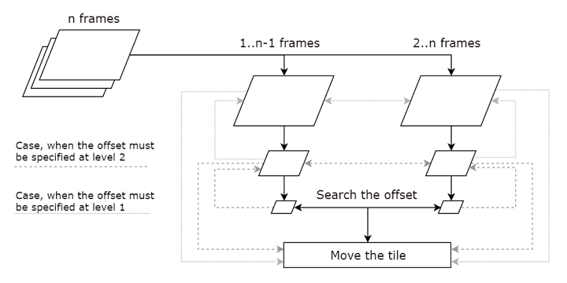

## Software Architecture Specification

### Overview
The program input is a shuffled stream of YUV format.

Shuffling is as follows:

* The first frame remains unchanged.
* All other frames, starting from the second, are broken into rectangular tiles 64x64px and these tiles are shuffled inside the frame.

The program output is restored original stream.

### Algorithm

General principle of the program:

The first frame is used as a reference for the shuffled second frame. Then the restored second frame is used as a reference for the shuffled third frame, etc.
Two layers are created for each frame: layer 1 is original frame, layer 2 is a twice reduced layer 1, layer 3 is a twice reduced layer 2.

For motion estimation used PreENC. First, we make a motion estimation on the 3 layer. Here the tile and the macroblock (for the PreENC) size of 16x16. For each macroblock we get a lot of motion vectors. Each vector has a magnitude of distortion. All wrong vectors, whose distortion is large, are removed from consideration.

If after this procedure there are no correct vectors or it is impossible to choose from several, the procedure is repeated at the 2st level (tile size is 32x32, macroblock size is 16x16). If in this case the vector could not be found, the procedure is repeated at the 1st level (tile size is 64x64, macroblock size is 16x16).

The found vector shows, how the macroblock was shifted relative to the reference frame.These coordinates will be rounded to the coordinates of the nearest tile. Then the tile will be moved to these coordinates using VPP in composition mode.