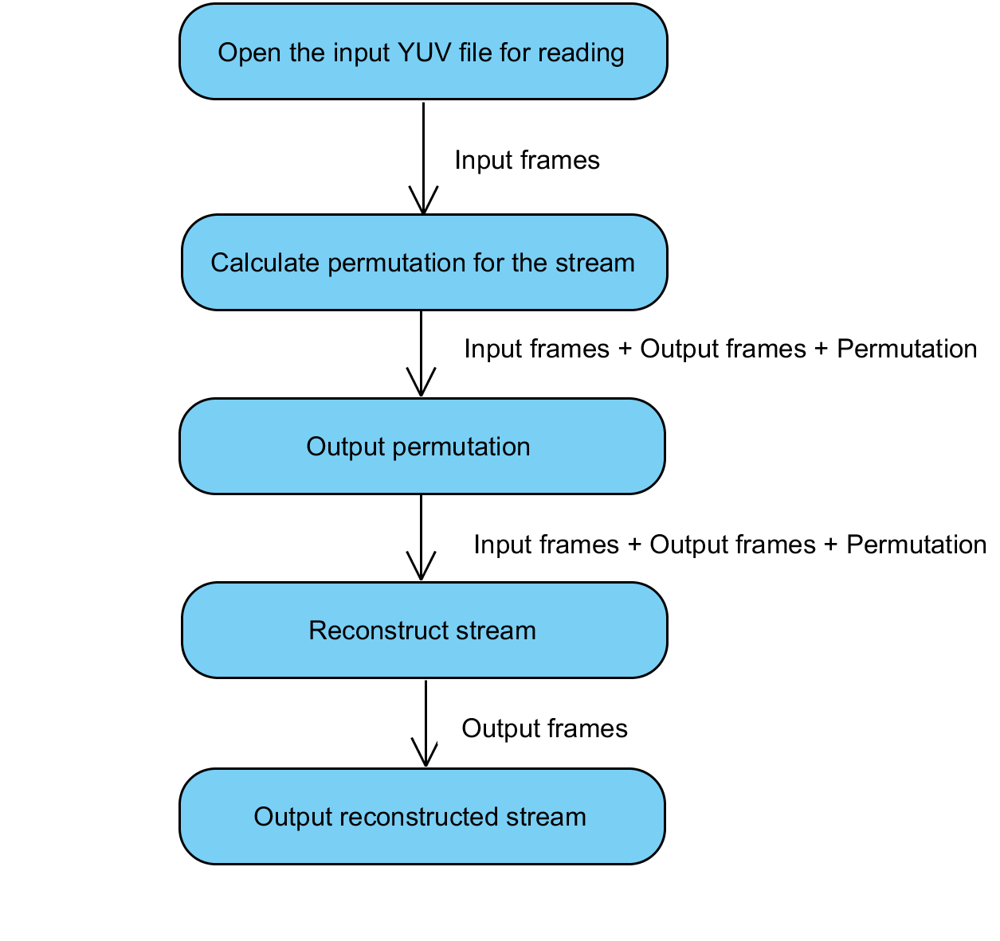
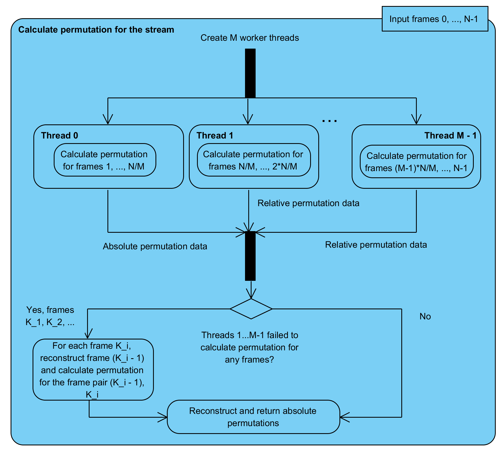
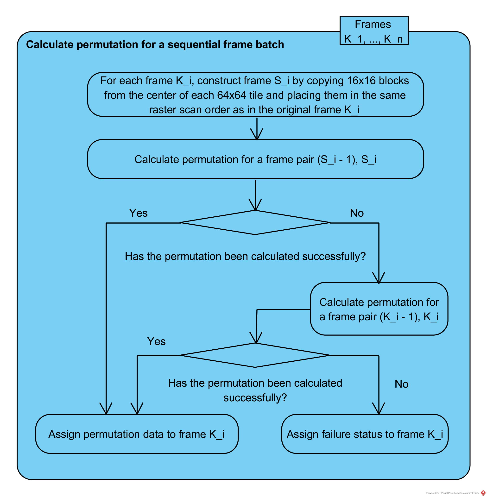
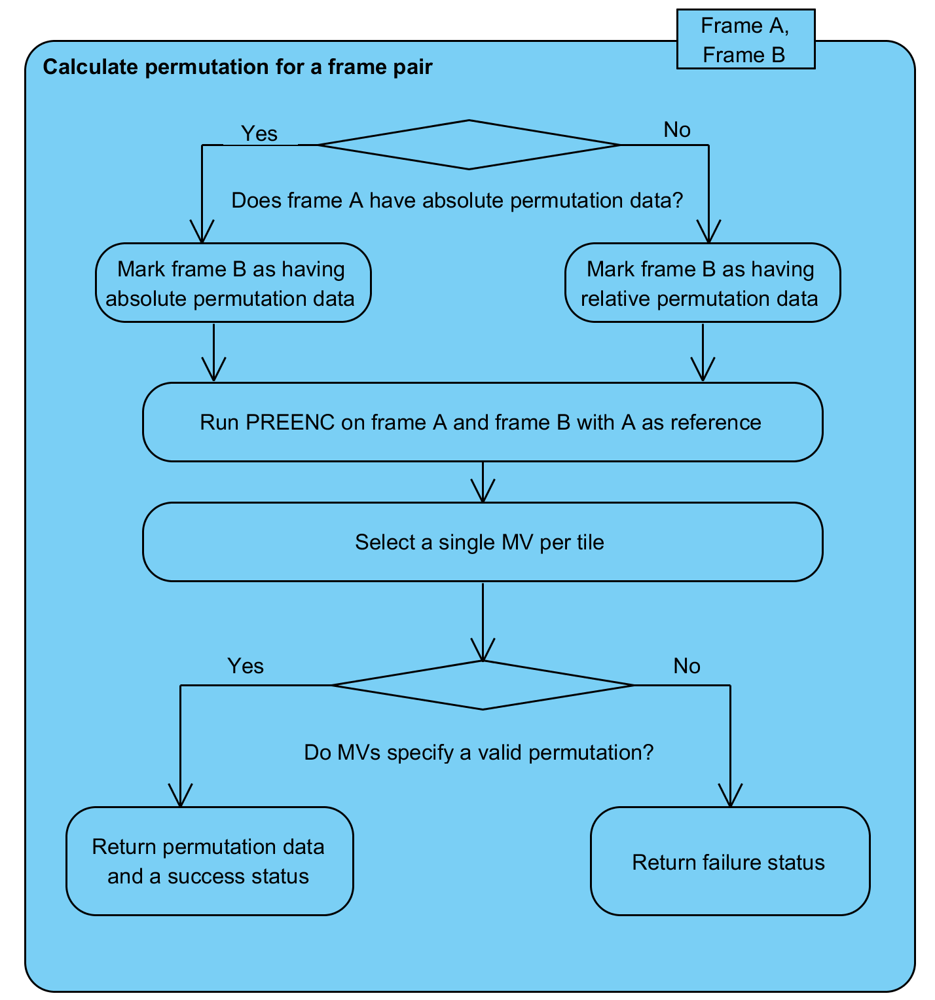

# "deshuffler"
## Software Architecture Specification
##### Vasily Shamporov, Apr 2017
# #

###Overview
The program is written in C++ (with the support of C++14 standard). The basic program control flow is presented on the figure below:

The input YUV file , which has every frame (except the first one) shuffled in random order on the basis of 64x64 blocks, is first opened for reading; next, for each frame the data which describes the correct position of each shuffled tile on the unshuffled frame ("permutation data") is calculated. Afterwards (optionally) the original unshuffled stream is completely reconstructed and output to the disk using the input shuffled stream and the permutation data calculated in the previous step. The calculation of permutation data is based on motion estimation between consecutive frames of the input YUV stream. More details on some of the steps of the algorithm follow.
###Details
#####Calculate permutation for the stream

This step incorporates frame-level parallelism to improve performance - the input stream is divided into M equal batches, with consecutive frame sequences in each batch, and each part is assigned a worker thread. Each worker thread then calculates permutation data between pairs of consecutive frames inside their batch, starting from the first one in display order.

The batch containing the first, unshuffled frame and the corresponding worker thread (hereafter "primary" thread) are of special interest. Non-primary threads will calculate permutation data between pairs of shuffled frames, wherefore the primary thread is able to always calculate permutations between a shuffled frame and a reconstructed preceding frame, since its batch has the first, unshuffled frame. Hence, the permutation data produced by non-primary threads will only be relative to the first frames  of their respective batches, while permutation data produced by the primary thread will be absolute. An additional post-processing step is therefore required to produce absolute permutation data for the whole stream.

It is assumed that motion estimation between a shuffled frame and an unshuffled one will be more effective in producing correct permutation data than motion estimation between two shuffled, although consecutive frames and the calculation of permutation data for some of the frames in the non-primary thread batches may fail (see below for more details on the failure status assignment). To address this, the failed frames from each non-primary thread are aggregated, and then, after all threads have finished their calculations, the failed frames are processed in sequential order while using reconstructed preceding frames (which should be available by this moment of time, either as video data or absolute permutation data), and the correct permutation data is calculated for these frames.

#####Calculate permutation for a sequential frame batch

As stated above, each worker thread processes its own batch of sequential frames starting with the first pair of consecutive frames in display order. Calculating permutation data between two frames is performed using FEI PREENC, which performs motion estimation on a 16x16 block basis, while shuffled tiles have a size of 64x64 pixels. Theoretically, it is sufficient to only perform motion estimation for a single 16x16 block inside the 64x64 tile to calculate the tile position on the preceding frame. This may be prone to errors, but brings obvious performance gain; therefore, as a first step, for each pair of consecutive frames (K_(i - 1), K_i) a pair of special frames (S_(i - 1), S_i) is constructed by taking a 16x16 block from the center of each 64x64 tile and putting them side-by-side in the same raster scan order as for the original frames. The permutation data is then calculated for frames (S_(i - 1), S_i). If this fails, the algorithm falls back to motion estimation on the full-res frames (K_(i - 1), K_i). If this fails as well (if, for example, it was not possible to reconstruct frame K_(i - 1)), then the whole frame K_i is assigned a failure status and the processing progresses to the next pair of frames in the batch. It is assumed that the primary thread should not fail at this point, otherwise deshuffling as a whole fails since no other means to improve the motion estimation accuracy are included in the algorithm.

#####Calculate permutation for a frame pair

When permutation data is calculated for two frames A and B, one of them serves as a reference for the other in terms of motion estimation. Let A be the reference frame - depending on the situation, it may already have absolute permutation data (calculated previously by the primary thread), relative permutation data (calculated previously by a non-primary thread), or no permutation data at all (if motion estimation by a non-primary thread failed, or frame A is the first one in a batch belonging to a non-primary thread). If frame A has absolute permutation data, then frame B will be assigned absolute permutation data after PREENC run as well, and it is marked as such. Otherwise, frame B is marked as having relative permutation data.

Next, PREENC is run on frames A and B with A as reference. The output of PREENC is a map of (multiple) motion vectors per each 16x16 block of the frame and corresponding distortion values. Afterwards, if frames A and B were down-sized using the algorithm described in the previous section, a single best motion vector is selected for each 16x16 block (representing a 64x64 tile on the full-resolution frame); otherwise, if frames A and B had full resolution, a single best motion vector is selected for each 64x64 tile. Either way, at this point a per-tile map of motion vectors is produced for frame B relative to frame A. If this map specifies a valid permutation of tiles (i.e. no two MVs point to the same tile on frame A), then the calculation is deemed successful and actual permutation data is computed and assigned to frame B; a success status is returned. Otherwise, the calculation is deemed a failure - no permutation data is computed and a failure status is returned.

#####Permutation data
The permutation data format for frame B relative to frame A is simple - it is a list of integers (one integer for each tile of frame B in raster scan order), each one representing a position of the corresponding tile on frame A in raster scan order.
